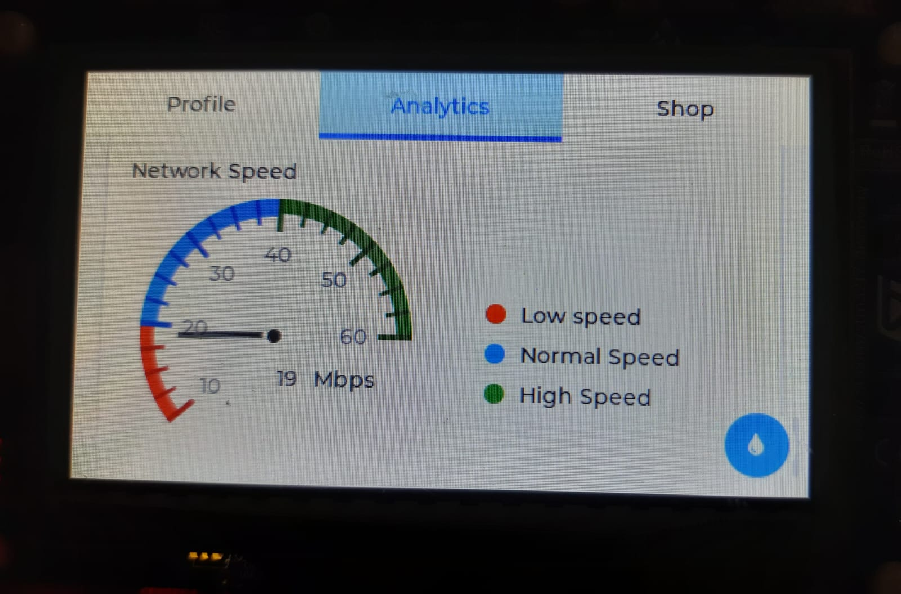
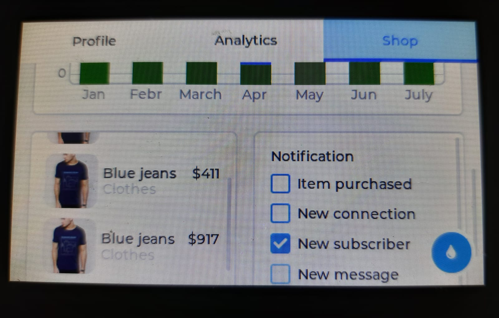

# STM32F746G-DISCO – LVGL Demo

This project demonstrates the integration of the **LVGL graphics library**
on the **STM32F746G-DISCO** board using the onboard TFT LCD (480×272).

The focus of this project is **correct system-level integration**:
memory placement, cache handling, and stable rendering using LTDC.

---

## Demo

<table border="0" cellspacing="0" cellpadding="0">
  <tr>
    <td align="center" style="padding:4px">
      
      
<small>Analytics Screen</small>

    </td>
    <td align="center" style="padding:4px">
      
      
<small>Memory Details</small>

    </td>
  </tr>
  <tr>
    <td align="center" style="padding:4px">
      
      
<small>Checkbox Widgets</small>

    </td>
    <td align="center" style="padding:4px">
      
      
<small>Spinner Widgets</small>

    </td>
  </tr>
</table>

---

## Project Overview

This repository provides a reference implementation of LVGL running on
STM32F7-class microcontrollers.

The project is intended for developers who want to understand how to
properly use LVGL with external SDRAM and LTDC on Cortex-M7 MCUs.

---

## What is implemented

- LVGL demo widgets running on real hardware
- LTDC-based display driver
- Touch input support
- Double buffering for smooth rendering
- LVGL heap placed in external SDRAM
- LVGL draw buffers placed in external SDRAM
- Framebuffer located in SDRAM
- MPU configuration for cache-safe LTDC access
- D-Cache clean operations for correct display updates

---

## Hardware

- STM32F746G-DISCO
- 4.3" TFT LCD (480 × 272)
- External SDRAM (8 MB)

---

## Software

- STM32CubeIDE
- LVGL
- STM32 HAL & BSP
- LTDC + DMA2D

---

## License

This project is licensed under the MIT License.
